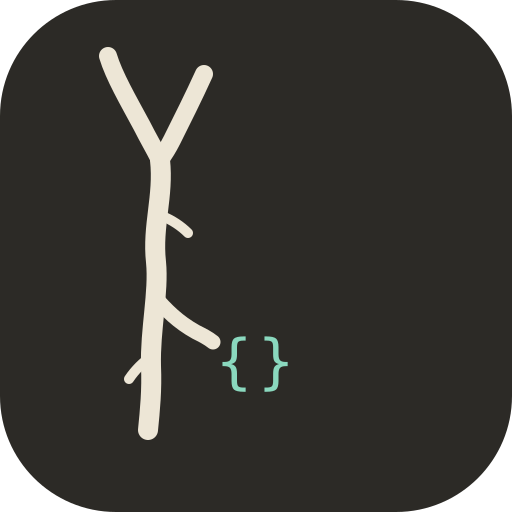

# Oraclebone（甲骨）

<div align="center">
  
  <h3><b>骨は裂ける。モデルは読む。</b></h3>
  <p>
    <a href="https://pypi.org/project/oraclebone/"><code>uvx oraclebone-mcp</code></a> ·
    <a href="https://sapuyou45-bit.github.io/oraclebone/">ホームページ</a> ·
    <a href="https://github.com/sapuyou45-bit/oraclebone/releases/tag/v8.2.0">v8.2.0</a>
  </p>
</div>

> 三千年前、殷の王は占卜を骨に刻んだ——人類最初の「監査可能な神託記録」。Oraclebone は同じ規律を AI エージェントにもたらす：監査済みスクリプトが結果を生成し、モデルは与えられた結果を解釈するだけで、決して捏造しない。

<!-- mcp-name: io.github.sapuyou45-bit/oraclebone -->

[English](README.md) | [简体中文](README.zh-CN.md) | [日本語](README.ja.md)

<details>
<summary>デモ</summary>
<p align="center">
  <a href="https://pypi.org/project/oraclebone/">
    
  </a>
</p>
</details>

[](https://github.com/sapuyou45-bit/oraclebone/actions/workflows/tests.yml)
[](https://github.com/sapuyou45-bit/oraclebone/actions/workflows/release.yml)
[](https://pypi.org/project/oraclebone/)
[](https://pypi.org/project/oraclebone/)
[](https://github.com/sapuyou45-bit/oraclebone/releases)
[](https://opensource.org/licenses/MIT)
[](https://github.com/sapuyou45-bit/oraclebone/actions/workflows/tests.yml)
[](https://github.com/sapuyou45-bit/oraclebone/discussions)

✨ AI agent のためのオープンソース占術 skill 集です。乱数、カードドロー、起卦はツールが行い、AI は具体的な結果だけを解釈します。

`oraclebone` は、タロット、易経、小六壬、そして今後追加される象徴体系のための実用的な skill コレクションです。agent ワークフロー向けに、監査可能なランダム性、明確な方法境界、再利用できる解釈テンプレートを重視しています。

このプロジェクトは占術を、決定論的な予言ではなく、象徴的推論と内省の道具として扱います。

## ⚡ AI Agent 向けワンラインインストール

これを AI agent に貼り付けてください。

```text
Install AI Divination Skills for this agent: https://raw.githubusercontent.com/sapuyou45-bit/oraclebone/main/docs/install.md
```

Claude 形式のローカル skills ディレクトリへ直接インストールすることもできます。

```bash
curl -fsSL https://raw.githubusercontent.com/sapuyou45-bit/oraclebone/main/install.sh | bash
```

デフォルトのインストール先は `~/.claude/skills` です。別の agent skill ディレクトリを使う場合は `AI_SKILLS_DIR` を設定してください。

## ✨ 概要

多くの AI 占いプロンプトでは、モデルが結果そのものを作ってしまいます。このリポジトリは役割を分けます。

1. ローカルスクリプトがカード、卦、小六壬の位置を生成する。
2. AI agent がその具体的な結果を、安全境界の中で解釈する。

これにより、読みはテスト、再現、監査、再利用がしやすくなります。

## 🧭 方法論的厳密性

基本ルールは明確です。スクリプト、またはユーザーが物理的に得た結果がカード、卦、位置を生成します。AI はその生成済みの結果を解釈するだけで、占術結果そのものは生成しません。

これは占術の科学的有効性を証明するものではありません。象徴的推論をより監査しやすくするための workflow です。

- 実際の reading はデフォルトでシステム乱数を使う
- seed はテストと再現可能な demo のみ
- 各 skill が伝統的方法と制限を記録する
- JSON 出力に監査可能な方法メタデータを含める
- 近似モードは warning を出し、伝統的精度を装わない

## 🌐 多言語ドキュメント

GitHub Pages のルートページは、デフォルトで簡体中文を表示します。English や 日本語に切り替える場合は、ページ上部の言語スイッチャーを使います。

[公開ページを開く](https://sapuyou45-bit.github.io/oraclebone/)

ローカルプレビュー：

```bash
python3 -m http.server 8000 -d docs
```

公開ページ：

```text
https://sapuyou45-bit.github.io/oraclebone/
```

## 🧩 含まれる Skills

| Skill | 内容 | スクリプト |
| --- | --- | --- |
| `tarot` | 内省、意思決定、創作の停滞、プロジェクトの見直しのためにカードを引きます。 | `skills/tarot/scripts/draw.py` |
| `iching` | 六本の爻から本卦と之卦を出力します。 | `skills/iching/scripts/cast.py` |
| `xiaoliuren` | 旧暦風の数値、または軽量なグレゴリオ暦 fallback から小六壬を起こします。 | `skills/xiaoliuren/scripts/cast.py` |
| `bazi` | グレゴリオ暦の生年月日時から八字（四柱）を立てます。オプションの `lunar-python` 拡張が必要です。 | `skills/bazi/scripts/cast.py` |

## 🚀 クイックスタート

PyPI からインストール：

```bash
pip install oraclebone
```

またはローカル checkout から：

```bash
pip install .
```

開発中は editable mode も使えます。

```bash
pip install -e .
```

3 つの体系を同じ入口で呼び出せます。

```bash
ai-divination tarot --deck major --spread three-card --reversals
ai-divination iching --method yarrow
ai-divination xiaoliuren --method numbers --month 3 --day 12 --hour 7
```

agent 用の解釈テンプレートも表示できます。

```bash
ai-divination template tarot
```

Python API から直接使うこともできます。

```python
from oraclebone.tarot import draw
from oraclebone.iching import cast
from oraclebone.xiaoliuren import cast_numbers
```

従来どおり、下層のスクリプトを直接実行することもできます。

```bash
python3 skills/tarot/scripts/draw.py --deck major --spread three-card --reversals
python3 skills/iching/scripts/cast.py --method coins
python3 skills/iching/scripts/cast.py --method yarrow
python3 skills/xiaoliuren/scripts/cast.py --method numbers --month 3 --day 12 --hour 7
```

再現可能な demo には seed を使います。

```bash
python3 skills/tarot/scripts/draw.py --spread decision --seed demo
python3 skills/iching/scripts/cast.py --method yarrow --seed demo
```

すべてのスクリプトは JSON を出力します。

## 📦 Agent Skill としてインストール

AI agent にリモートのインストール手順を読ませて setup できます。

```text
Install AI Divination Skills for this agent: https://raw.githubusercontent.com/sapuyou45-bit/oraclebone/main/docs/install.md
```

shell から直接インストールすることもできます。

```bash
curl -fsSL https://raw.githubusercontent.com/sapuyou45-bit/oraclebone/main/install.sh | bash
```

インストーラーはデフォルトで `tarot`、`iching`、`xiaoliuren` を `~/.claude/skills` にコピーします。他の agent skill ディレクトリを使う場合は `AI_SKILLS_DIR` を設定してください。

手動インストールは、必要な skill フォルダを agent の skill ディレクトリへコピーするだけです。

```bash
mkdir -p ~/.claude/skills
cp -R skills/tarot ~/.claude/skills/tarot
cp -R skills/iching ~/.claude/skills/iching
cp -R skills/xiaoliuren ~/.claude/skills/xiaoliuren
```

各 skill は自己完結型です。

```text
skills/name/
  SKILL.md
  agents/openai.yaml
  scripts/
  references/
```

必要な skill だけを個別にコピーしてください。

各 skill スクリプトは単独フォルダでも動作します。Python package がインストール済みなら package runtime に委譲し、skill フォルダだけをコピーした場合は、その skill に同梱された standalone スクリプトへ fallback します。

## 🤖 Agent の振る舞い

各 skill は agent に次のことを求めます。

- 具体的な抽選/起卦結果を生成または受け取る
- 必要なときだけ簡潔な参照資料を読む
- 共有レスポンス形式で解釈する
- 確定的表現、宿命論、専門的助言を避ける

共有ガイド：

- `shared/methodology.md`
- `shared/interpretation-protocol.md`
- `shared/response-contract.md`
- `shared/randomness-protocol.md`
- `shared/safety-policy.md`
- `shared/interpretation-style.md`

## 🧪 Examples

- `examples/tarot-decision.md`
- `examples/iching-strategy.md`
- `examples/xiaoliuren-daily.md`

## 🧠 Claude Desktop / Codex など MCP ホストから使う

`oraclebone` には **MCP サーバー**（`ai-divination-mcp`）が同梱されています。
[Model Context Protocol](https://modelcontextprotocol.io/) 対応ホスト（Claude Desktop、Codex、
Continue、Cursor など）は 1 行の設定でマウントでき、モデルは 5 つのツール
`tarot_draw`、`iching_cast`、`xiaoliuren_cast`、`bazi_cast`、`interpretation_template` を使えます。

モデルが結果を捏造することはありません。サーバーがローカルで監査済みスクリプトを実行します。

### Claude Desktop での設定

```bash
pip install oraclebone
```

その後 `~/Library/Application Support/Claude/claude_desktop_config.json`（macOS）または
`%APPDATA%\Claude\claude_desktop_config.json`（Windows）を編集：

```json
{
  "mcpServers": {
    "divination": {
      "command": "ai-divination-mcp"
    }
  }
}
```

Claude Desktop を再起動。「今日の決断のために 3 枚タロットを引いて」と話しかけてください。

### クライアント別セットアップガイド

コピペ用の JSON 設定と例プロンプト：

- [Claude Desktop](docs/clients/claude-desktop.md)
- [Codex CLI](docs/clients/codex.md)
- [Cursor](docs/clients/cursor.md)
- [Continue](docs/clients/continue.md)

## 🛡️ 安全境界

これらの skills は、医療、法律、金融、危機対応の助言には使いません。

よい読みは：

- 結果を象徴的な内省として扱う
- 主な解釈を生成された結果に結びつける
- ユーザーの主体性を保つ
- 小さく可逆的な次の一歩を提案する
- 不確実性を明確に示す

詳しくは `ETHICS.md` を参照してください。

## 🛠️ 開発

Python 3 以外の実行時依存はありません。

テスト：

```bash
python3 -m unittest discover -s tests
```

## 🗺️ ロードマップ

近いうちに：

- Python package 公開用 workflow を追加する。
- CI の自動 skill validation をさらに拡充する。
- MVP skills の参照資料を拡充する。
- 例の読みを増やす。
- agent 連携例を増やす。

将来：

- `meihua`
- `liuyao`
- `runes`
- `numerology`
- `astrology`

## 📄 License

MIT
